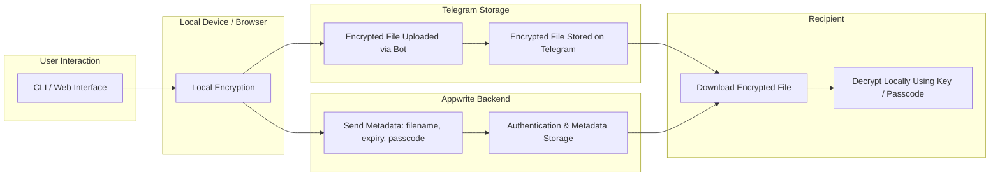

# tsbin (Trashbin)

**tsbin** is a simple, open-source, temporary file-sharing application that allows users to securely upload, store, and share files. Encrypted files are stored via **Telegram**, while **Appwrite** handles authentication and metadata.

All files are **end-to-end encrypted**, ensuring privacy and security.

This project is intended **for legal and ethical use only**. The team does not support sharing illegal or unethical content.

---

## Features

- End-to-end encrypted file storage
- Temporary / ephemeral sharing (files auto-expire)
- Supports **any file type**: images, videos, snippets, documents, etc.
- Optional passcode protection for access
- CLI-first interaction for uploading and retrieving files
- **Web interface support** for non-CLI users
- Lightweight, simple, and open-source

---

## How It Works



1. **Local Encryption:** Files are encrypted on the user’s device before uploading. This ensures that the raw file is never exposed to Telegram or tsbin servers in plaintext.
2. **Upload via Telegram Bot:** Encrypted files are sent to Telegram for storage. Telegram only stores the encrypted data.
3. **Metadata & Auth via Appwrite:** Appwrite manages user authentication, file metadata, expiry, and optional passcodes.
4. **Sharing:** Users can generate temporary links with optional passcodes for secure sharing.
5. **Download & Decryption:** Recipients download the encrypted file and decrypt it locally using the encryption key or passcode.

> **Security Note:** Only users with the encryption key or passcode can access the file. tsbin never sees unencrypted data.

---

## Getting Started (Planned)

### Prerequisites

- Node.js >= 18
- npm or yarn
- Telegram account & bot token
- Appwrite server instance for auth and metadata

### Installation (Planned)

```bash
git clone https://github.com/yourusername/tsbin.git
cd tsbin
npm install
```

### Setup Telegram Bot (Planned)

1. Create a bot using [BotFather](https://t.me/BotFather) on Telegram.
2. Copy the bot token and set it in a `.env` file:

```
TELEGRAM_BOT_TOKEN=your_bot_token_here
```

### Setup Appwrite (Planned)

1. Install and configure Appwrite server.
2. Configure authentication (email/password, OAuth, etc.).
3. Set Appwrite endpoint and project credentials in `.env`:

```
APPWRITE_ENDPOINT=your_appwrite_endpoint
APPWRITE_PROJECT_ID=your_project_id
APPWRITE_API_KEY=your_api_key
```

### Usage (Planned)

**Upload a file via CLI**

```bash
npx tsbin upload /path/to/file --passcode 1234
```

**Download a file via CLI**

```bash
npx tsbin download <file-id> --passcode 1234
```

**Encrypt & share snippets**

```bash
npx tsbin snippet "Hello World" --passcode 1234
```

**Web Interface**

- Users can upload, browse, and download files through a minimal web interface.
- Web uploads are encrypted locally in the browser before sending to Telegram.

---

## Security & Privacy

- **End-to-end encryption**: Only authorized users with the key or passcode can access files.
- Optional **passcode protection** for sharing.
- Temporary storage ensures files expire automatically.
- tsbin does **not** access unencrypted files.

---

## TODO / Planned Features

- [ ] Build CLI for upload, download, and snippet sharing
- [ ] Integrate Telegram bot for storage
- [ ] Integrate Appwrite for authentication and metadata management
- [x] Implement local encryption & decryption
- [x] Add optional passcode-protected links
- [x] Implement temporary file expiry
- [x] Build lightweight web interface
- [ ] Detailed documentation for contributors

---

## License

MIT License — free and open-source

---

## Ethical Use

tsbin is designed for **legal and ethical sharing only**. Do not use this application for illegal, harmful, or unethical activity.
